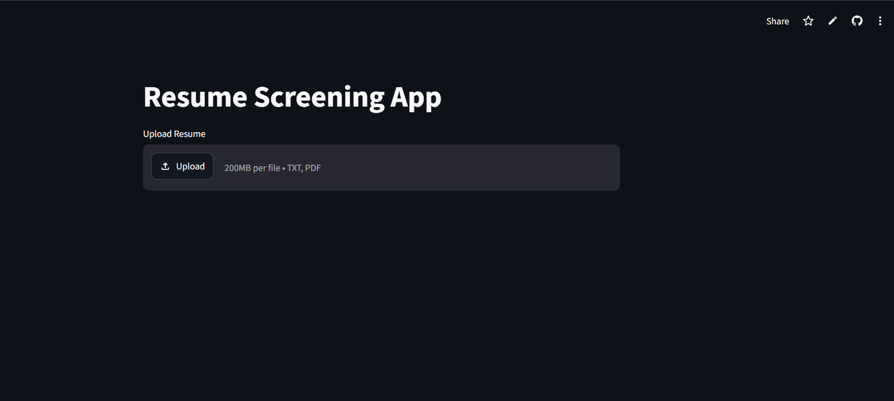
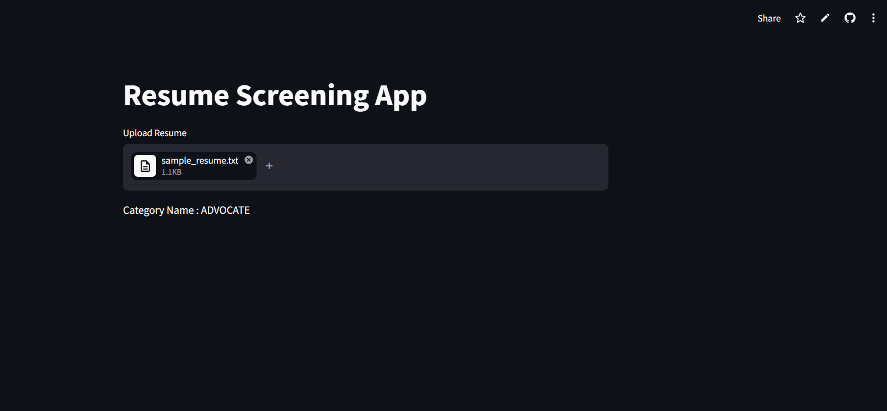

# 📄 Resume Screening System using NLP

An end-to-end **Natural Language Processing (NLP)** project that automatically classifies resumes into predefined job categories using Machine Learning. The application is built with **Python**, **Scikit-learn**, and **Streamlit**, and is deployed as an interactive web application.

---

## 🚀 Live Demo

🔗 **Application:** https://hnbb8gxa3dqhvrgcqjc6mo.streamlit.app/

---

## 📂 GitHub Repository

🔗 https://github.com/BOINI-VAMSHIKRISHNA/Resume-Screening-End-to-End-NLP-Project

---

## ✨ Features

- Clean and preprocess resume text
- Remove URLs, mentions, punctuation, and special characters
- Perform tokenization, stop-word removal, and lemmatization
- Convert text into numerical features using **TF-IDF**
- Predict resume category using a trained **Logistic Regression** model
- Interactive and user-friendly **Streamlit** interface
- Real-time resume classification

---

## 🛠️ Tech Stack

| Category | Technologies |
|----------|--------------|
| Programming Language | Python |
| Machine Learning | Scikit-learn |
| NLP | NLTK |
| Data Processing | Pandas, NumPy |
| Vectorization | TF-IDF Vectorizer |
| Model | Logistic Regression |
| Web Framework | Streamlit |
| Model Serialization | Pickle |

---

## 📁 Project Structure

```text
Resume-Screening-End-to-End-NLP-Project/
│
├── app.py                  # Streamlit application
├── preprocess.py           # Resume preprocessing functions
├── model.pkl               # Trained Logistic Regression model
├── tfidf.pkl               # TF-IDF Vectorizer
├── encoder.pkl             # Label Encoder
├── requirements.txt        # Project dependencies
├── README.md               # Project documentation
├── .gitignore
└── dataset/
    └── Resume.csv
```

---

## ⚙️ Installation

### 1️⃣ Clone the Repository

```bash
git clone https://github.com/BOINI-VAMSHIKRISHNA/Resume-Screening-End-to-End-NLP-Project.git
```

### 2️⃣ Navigate to the Project

```bash
cd Resume-Screening-End-to-End-NLP-Project
```

### 3️⃣ Create a Virtual Environment

**Windows**

```bash
python -m venv .venv
.venv\Scripts\activate
```

**Linux / macOS**

```bash
python3 -m venv .venv
source .venv/bin/activate
```

### 4️⃣ Install Dependencies

```bash
pip install -r requirements.txt
```

### 5️⃣ Run the Streamlit App

```bash
streamlit run app.py
```

---

## 🧠 Machine Learning Workflow

```text
Resume Text
      │
      ▼
Text Cleaning
      │
      ▼
Tokenization
      │
      ▼
Stop-word Removal
      │
      ▼
Lemmatization
      │
      ▼
TF-IDF Vectorization
      │
      ▼
Logistic Regression Model
      │
      ▼
Predicted Resume Category
```

---

## 📸 Application Screenshots

### Home Page

> 

### Prediction Result

> 

---

## 📊 Future Enhancements

- Resume upload using PDF/DOCX
- ATS Resume Score
- Job Description Matching
- Skill Extraction
- Resume Ranking
- Transformer-based Models (BERT)
- Explainable AI (XAI)

---

## 📦 Requirements

```
streamlit
scikit-learn
pandas
numpy
nltk
joblib
```

---

## 👨‍💻 Author

**Boini Vamshi Krishna**

- GitHub: https://github.com/BOINI-VAMSHIKRISHNA
- LinkedIn: [https://www.linkedin.com/in/](https://www.linkedin.com/in/boini-vamshi-krishna-b88b33265/)

---

## ⭐ Support

If you found this project useful, please consider giving it a ⭐ on GitHub.

Happy Coding! 🚀
````

